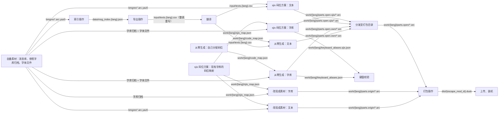

# 实现细节

一套管线能给多种语言分别打包
配置文件里的一个本地化方案就是一次打包任务，在里面写清源素材目录、列名、目标目录和元信息；
中间产物按语言分目录，放在 `work/<lang>/` 下。

## 管线流向

素材一路走到成品：先索引、再导出译文，译文配上字库造出资源，资源分发至打包目录后打包成 `.dusk`；每条边上的路径就是那一份产物

命令与顺序见[构建指南](构建指南.md)

## 素材与源文本

素材根由顶层 `input_dir` 决定，默认 `input/`。消息库、参照字库、译文表都放在它下面。

| 路径 | 内容 |
| --- | --- |
| `<lang 的 source>/bmgres.arc.yaz0` … `bmgres99.arc.yaz0` | 10 个消息库：Yaz0 压缩的 RARC，里面装 BMG。目录取自 `langs.<lang>.source` |
| `<font_source>/fontres.arc.yaz0`、`rubyres.arc.yaz0` | 两套参照字库：Yaz0 压缩的 RARC，里面装 BFN。目录缺省是 `input/font` |
| `<font_source>/rodan_b_24_22.bfn`、`reishotai_24_22.bfn` | 同上，只是解压后的文件，改现成素材时要用 |
| `input/texts.<lang>.csv` | 译文表，见[译文与索引](#译文与索引) |

消息库里的文件名是 `zel_00.bmg` … `zel_08.bmg` 与 `zel_99.bmg`，和引擎 `d_meter2_draw.cpp` 里的
`bmg_filename[]` 一致；字库归档里的内层名是 `rodan_b_24_22.bfn` 与 `reishotai_24_22.bfn`，和
`mDoExt_initFont0` / `initFont1` 一致。

条数如下：`bmgres.arc` 装两张表，`zel_00.bmg` 5000 条消息、`zel_unit.bmg` 15 条单位（同一个量词的单数、复数各一条）；
`bmgres1.arc` … `bmgres8.arc` 各装一张表，依次 1820 / 1351 / 508 / 1606 / 1477 / 1357 / 1173 / 1299 条消息；
`bmgres99.arc` 是 109 字节的空壳。

源文本就在 BMG 里：消息正文在 `DAT1`，单位表的正文在 `STR1` 池。编码由文件自己声明，写在头 0x10：`1` 是每字节一个
字符，`2` 是 2 字节码位，`3` 是 ShiftJIS。tag 的几何跟着编码变，数值见[容器格式](#容器格式)。

资源名 `fontres.arc` / `bmgres.arc` 就是打包时写进包内的名字。

## 译文与索引

译文表 `input/texts.<lang>.csv` 是之后唯一要维护的东西。打包只读 `key` 与译文列 `locale_col`，其余列
不参与；列是 `key,<draft_col>,<locale_col>,comment`，两个列名和源素材目录都由本地化方案定。

这张表从源素材导出，分两步：先算索引，再导出。

- 索引 `data/msg_index.<lang>.json` 记的是这张表要写哪些条目：每个 BMG 的名字、条数、条目尺寸、
  encoding、消息号列表 `mid1`、条目属性（去重表 + 每段的重复次数）、STR1 大小、尾部块 tag 与大小。它由源素材现算，
  换了素材或换了语言就得重算。导出与打包都读它。
- 导出时一条文本怎么对应到字段，看 `data/text_resources.json` 里的 `"shape"` 写的是哪种：
  - `messages`：一条文本 = `DAT1` 正文，条目号 = 消息号，如 `zel_03/5000`；
  - `string_pairs`（单位表 `zel_unit`）：条目里的两个 u16 字段是 `STR1` 的**字节偏移**，条目号 = 条目下标，如 `zel_unit/0/one`、
    `zel_unit/0/other`（同一个量词的单数形与复数形）。引擎按数值是否等于 1 选其中一条，拼成「数字 + 空格 + 标签」
    插进消息串。
- 导出是整表重写：译文列与底稿列都写入源素材原文，要保留的译文先备份。

表里一行怎么写：

- 一行 = 一条文本。`key` = `<资源>/<条目>[/<字段>]`，资源名是 BMG 文件名去掉 `.bmg`。
  消息表的条目号是消息号；同一消息号出现两次时，后一条补 `#<下标>`。原归档里真有这种：`zel_04` 有
  1607 条，末条与第 613 条同号且文本为空，引擎只会查到前一条。
- 字面语法

  | 写法 | 含义 |
  | --- | --- |
  | 普通字符 | 原样 |
  | `\n` | 换行（U+000A） |
  | `\xNN` | 其它控制码 |
  | `<Tggcccc>` | 标签（gg = 高字节） |
  | `<Tggcccc:hex>` | 带数据的标签，hex = payload 字节，如 `<T000036:001e>` |

- 打包时有几处有意改写：标签 `060005`（装饰性 ※）换成字面 `※`；默认名 `zel_00/898`、`zel_00/899`
  写成单字节码位 `A1..A5`。
- 单位表的两个字段按正文同一套编码写：ASCII 与换行 1 字节，其余先查码位表、再写 2 字节。池串会被引擎
  直接拼进消息串、随消息一起解，字库用别的编码就查不到。从零生成时重建 `STR1` 池；改现成素材
  只重编码 `DAT1` 正文，池里仍是原文件里的 2 字节码位，`zel_unit` 那 15 条单位 `one` / `other` 会画错，
  根子在欧版和中文版的渲染逻辑不同。
- 表里的条目必须与索引一一对上：缺 key、多 key、key 重复、行列数与表头不符都不行。
- 字面串必须能读回同一串 token：真带反斜杠、或形如 `<T……>` 的文本表达不了，会被当成标签。

## 生成资源

资源分两类：`文本`和`字库`
两类各出 `bmgres*.arc` 与 `fontres.arc` / `rubyres.arc`，合起来就是一个包的内容
每个环节都有各自的操作：索引、导出、翻译、文本、字库、分发至打包目录、打包。

- 文本：译文按码位写进 BMG，重建 `DAT1`，单位表同时重建 `STR1` 池。码位方案有两种：`own`
  自己分配，保存至 `work/<lang>/code_map.json`；`sjis` 沿用现有字库的码位，保存至
  `work/<lang>/sjis_map.json`。
- 字库：按字体文件重渲染字形，或者沿用原字库位图只重排
  - 渲染方式与限制见[引擎侧的硬约束](#引擎侧的硬约束)

文本和字库有以下几种使用方式：

- 文本用 own 码位方案、字库重渲染: 产物保存至 `work/<lang>/parts.open.own/`。
- 拿游戏自带的素材改: 文本与字库都不重建，只在原文件里改块，产物保存至
  `work/<lang>/parts.origin/`。文件尺寸不变，码位沿用现有字库的那套，保留原字库位图的 `origin`
  变体只能这么出。文本取自源素材的原版原文，被引擎读错的那批码位搬进安全区，
  单位表 `zel_unit` 不重编码。
- 文本用 sjis 码位方案、字库重渲染，沿用现有字库的码位: 产物保存至 `work/<lang>/parts.open.sjis/`。

`open` 变体的资源目录是 `work/<lang>/parts.open/`，由 own 码位方案或 sjis 码位方案那两份产物抄进来
（一次只分发一套）；`origin` 变体的资源目录就是 `parts.origin/`，没有分发这一步。

**sjis 码位方案的局限**：只能画出「现有字库的码位表里有的字」。译文里出现现有字库没有的字符时，
没有码位可沿用，只能按原样写 Unicode 码位，而这类码位的首字节未必是合法的 Shift-JIS 前导字节，
引擎会把它读成两个字符。实测 `zel_unit/5/one` 就画成 `yÒ`：那一条的 `秒` 是 U+79D2，原字库表里没有。
要覆盖全部译文只能用 own 码位方案。

资源名不带地区或语言，`fontres.arc` / `rubyres.arc` / `bmgres*.arc` 都是。同一个资源要写进各地区的
`Font<region>`、`Msg<language>`，写哪儿看资源名的前缀。一个包里字库与文本必须是同一码位方案，
否则字库查不到文本里的码位。

`work/<lang>/` 下还有这几份中间产物：

| 路径 | 内容 |
| --- | --- |
| `code_map.json` | own 码位方案：字符 → 码位。文本与字库读同一份 |
| `sjis_map.json` | sjis 码位方案：现有字库的码位到新码位的映射 |
| `keyboard_aliases.json` | 名字键盘与默认名的别名产物，从零生成的字库操作写 |
| `keyboard_aliases.sjis.json` | 同上，sjis 码位方案的字库操作写；两张表不混用 |

## 打包与安装

`.dusk` 就是个 zip：`mod.json` + `overlay/<光盘内路径>`，或者 `textures/`。`mod.json` 里的 `icon` / `banner`
在包内是 `res/icon.png` / `res/banner.png`；源图放 `assets/`，config 里填本地 PNG 路径。

一个地区一份包，`discs` 里每项配一个地区与语言。各地区的包只有 `overlay` 下的目录名不同，分别是
`Font<region>` 和 `Msg<language>`；同一批文件只能装一个。包名由 id 推出来，id 里的 `.` 写成 `_`，
id 与其它元信息写在本地化方案里，见[配置与可调项](#配置与可调项)。

## 引擎侧的硬约束

译文用到的字按下面几条约束分配码位，写进 `work/<lang>/code_map.json`，字库读同一份：

1. 前导字节是合法的 Shift-JIS 前导，即 `0x81..0x9F` / `0xE0..0xFC`；
2. 码位 ≥ `0x8800`，否则会被引擎的 `change1ByteTo2Bytes` / `changeKataToHira` 改写；
3. 尾字节也是合法的 Shift-JIS 尾字节，即 `0x40..0x7E` / `0x80..0xFC`，不是 `0x7F`。几处引擎代码
   **逐字节**扫串：尾字节 `0x00` 被当成消息结束，`getStringKanji` / `getStringKana` 把 `0x1A` 当标签
   按长度跳步，`J2DPrint::parse` 把 `0x1B` 当控制码前缀。踩到就会被读错，症状是整串文字只剩半边；
4. 位于 JIS X 0208 未定义区，即 `0xEAA5..0xEFFC` / `0xF040..0xF9FC`：菜单资源与引擎字符串用的都是
   标准字符，避开它们才不会出现「一个码位两种含义」，症状是名字框的空格位画出游戏自带数据里的字；
5. 不和 `data/name_keyboard.json` 撞车，那是引擎名字键盘自己会查的表。

ASCII 用原码位；默认名的单字节码位用 `0xA1..0xA5`；键盘与图标的码位照原样写进。

字库这边还有几条必须守的：

- 字库必须是**单页**。页数按 `rows × cols` 算，拼成一张纹理；页数一多，拼合高度爆表、建纹理失败。
  所以 `rows × cols` 要容下全部字形。
- 从零生成时字形格自己排：`0x00..0x5F` 留给 ASCII，`MAP1` 走 method 0 恒等映射，格 = 码位 − 0x20，
  其余码位按升序接在后面。`WID1` 的前进宽度 = 字体前进宽度（em）× `INF1.width`，前导偏移按墨迹居中。
- 引擎会把半角 ASCII 换成全角码位，换不换看「最小 startCode」（`halftofull`，见
  `JUTResFont::getFontCode`）：`MAP1` 里有覆盖 `0x20..0x7F` 的段就不换。同时它又照那张表把那 95 个
  全角码位别名到同一批 ASCII 字形，免得哪条路径先转换过就查不到字形。

**名字与键盘**

- 默认名来自消息 `0x381`（`林克`）与 `0x382`（马，`伊波娜`）。这两个号是引擎侧的 INF1 下标，对应译文表的
  `zel_00/898` 与 `zel_00/899`，消息号 = 下标 + 1。名字输入按**单字节**取字，所以默认名得让单字节码位
  承载汉字：向 `MAP1` 追加 `0xA1..0xA5 → 林 克 伊 波 娜` 的别名，指向既有字形格，不新增格、不重渲染、
  不改 `WID1`；这两条文本写成原始字节 `A1 A2` / `A3 A4 A5`，两个变体都建。代价是一个字占一个字符位，
  名字上限 8 个汉字；玩家自己改名时，键盘仍只有拉丁字母。要改写的字表在本地化方案的 `default_name_chars`，
  哪个语言需要才写，不写就不动默认名，别的语言的原样保留；按单字节写哪几条在本地化方案的
  `default_name_cells`，按译表的 key 写，名字文本不从配置来，直接取译文表那一条。默认的 `langs.zh-Hans`
  的取值是 `林克伊波娜` + `["zel_00/898", "zel_00/899"]`。
- 中文输入键盘的表有 550 格，由 `data/name_keyboard.json` 提供，逐格建 `MAP1` 别名。从零生成的字库把
  550 格全部渲染。改现成素材时只能用现有字库的字形格，于是 393 格直接用，55 格换成简体写法，对照表是
  `NAME_VARIANT`，102 格两种写法都没有，只能指向空白字形：格子显示为空，但仍然可按。
- 上游 EU 键盘表里原字库缺的 51 格同样处理，这些格记在 `PAL_KEY_CODES` 里，含 Œ/œ。
  **所以「中文键盘整表可用」只对 open 变体成立。**
- 补全结果的字段有 `direct` / `variant` / `added` / `blanked` / `pal` / `name_default`，保存至
  「生成资源」里那两张 `keyboard_aliases*.json`。新增字形格会抬高 `GLY1.endCode`，上限是
  `rows × cols`，单页布局不变。
- 中文键盘本身是 `snnh/dusk-cn` 分支的功能，开关是 `game.enableChineseNameKeyboard`；上游 dusklight
  没有这个开关，名字只能打拉丁字母，但默认名照样显示中文，靠的是上面的单字节别名。
- 键盘按钮文案是消息 `0x38B/0x38C/0x388/0x38E`。
- 换过码位方案后，旧存档里的名字还是旧码位，会显示成错字。遇到这种就新建存档，或者重输一次名字。

## 配置与可调项

配置分两层:
  - `scripts/config.default.json` 放固有打包参数，`langs` 的现成示例也在这里，和本机相关的字段必须写到 local 里；
  - `scripts/config.local.json` 只写本机差异

两层递归合并，`langs` 段按语言
逐键合并，命令行 `--xxx` 再覆盖。

一个本地化方案里的字段如下：

| 字段 | 含义 |
| --- | --- |
| `source` | 源素材目录，相对仓库根 |
| `draft_col` / `locale_col` | 译文表的底稿列 / 译文列。打包只读译文列 |
| `default_name_chars` | 要改写成单字节码位的默认名字表。留空则忽略，见[引擎侧的硬约束](#引擎侧的硬约束) |
| `default_name_cells` | 哪几条按单字节码位写，如 `["zel_00/898", "zel_00/899"]`。文本取自译文表 |
| `input_dir` | 本地素材根，缺省 `input/`：消息库、参照字库、译文表都在它下面。`font_source` 不给时，默认位置也从它推 |
| `font_source` | 参照字库目录，缺省 `<input_dir>/font`。顶层可以写默认值，本地化方案能覆盖 |
| `discs` | **每个盘一项**的替换目录：`region` 决定字库目录 `Font<region>`，取 us/eu/jp；`language` 决定消息目录 `Msg<language>`，取 uk/us/de/fr/sp/it/jp |
| `mod` / `mod_origin` | 两个变体的完整元信息：id/name/version/author/description/icon/banner |

- 选哪一段用 `--lang <名字>`；不给就用 `default_lang`，配置里写了多个语言时必须给。
- `fonts` 只是默认值，游戏里两套字库各配 `file` / `em` / `gamma`，本地化方案可以只覆盖要改的那套。
  `out` 是成品包目录，本地化方案也能覆盖。
- `{region}` / `{language}` 在打包时展开：id 里用短名，如 `yiga.zh.hans.eu`；name/description 里用全称，
  如 `United States`。包名由 id 推出来，id 里的 `.` 写成 `_`。取值以本地化方案自己的 `mod` / `mod_origin` 为准。

可调的有这几处：

- 字体：`fonts.<字库>.file` / `em` / `gamma` 按字库单独配。`fonts.<字库>.ascent` / `descent` / `width` /
  `leading` 改字库的排版度量，默认值对齐原字库，主字库是 `42/6/42/48`，副字库是 `43/5/48/48`。
  `work/fonts/` 下的 `compare_*.png`、`orig_*.png` 是标定对照图。
- 码位方案（命令行 `--code-space`）：`own` 自己分配，配从零生成的字库；`sjis` 沿用 `work/<lang>/sjis_map.json` 里现有字库的码位，
  局限见[生成资源](#生成资源)。
- 加一段新语言：在 `config.default.json` 里新增一个项目，字段是 `source` / `draft_col` / `locale_col` / `discs` /
  `mod` / `mod_origin`，再重算索引与译文表。
- 目标目录：本地化方案的 `discs` 里每个盘一项 `region` 和 `language`，前者决定字库目录 `Font<region>`，
  后者决定消息目录 `Msg<language>`。换素材或只保某个地区时改这里。
- 输出：`out` 决定成品包目录，默认 `dist`，本地化方案可覆盖。

## 容器格式

**BMG（消息库）**

- 头 0x20 字节：`MESG` + `bmg1` + u32 文件大小 + u32 段数 + u8 encoding + 15 字节填充。
  文件大小**不含**尾部的 `FLW1` / `FLI1`。
- 段从 0x20 起，按 0x20 对齐，依次是 `INF1`（条目表）、`DAT1`（文本）、`MID1`（消息号列表）、
  `STR1`。后面可以跟 `FLW1` / `FLI1`，那是消息流脚本，没有正文文本。
- `INF1` 头 8 字节 = 条数(u16) + 条目尺寸(u16) + 4 字节填充；条目 = u32 DAT1 偏移 + u16 消息号 +
  u16 event_label_id + 12 字节属性（speaker、box_kind、draw_type、box_position、item_no、line_alignment、
  speaker_mood、camera_attr、talk_anim、face_anim、lines_per_page、padding）。
  引擎按条目的**消息号**查消息，属性决定说话人、框样式这些，两样都不能省。
- `MID1` 开头的 8 个字节 = 条数(u16) + form/supplement(u16) + 4 字节填充，后面是每条消息的消息号（u32）。
- `STR1` 是字符串池：本项目的归档里是 2 字节码位、`0000` 收尾。单位表（`zel_unit.bmg`）的正文存在这里，
  不放 `DAT1`，条目里的两个 u16 字段就是池内的字节偏移。
- 消息正文以编码里的 `0` 字符收尾；引擎读到第一个 `0` 就当消息结束。
- `encoding` 由文件自己声明，位置在头 0x10 字节，读取层按它切字符：`1` 是每字节一个字符，`2` 是
  2 字节码位，`3` 是 ShiftJIS，前导字节吃 2 字节。它不绑语言；本项目的消息容器一律写成 `3`，
  同一个文件里的字符串池 `STR1` 也是这个编码。
- tag 的几何跟着编码走：marker 是当前宽度下的 `0x1A`，2 字节码位的归档里是 `00 1A`，单字节归档里
  是 `1A`，后面紧跟 1 字节 `size`、3 字节 tag id、数据；**步进 = `size`**，payload = `size - 4 - marker 宽度`。
  实测中文素材 `input/msg` 与美版素材 `input/msg_us` 的 `bmgres3` 各 507 / 508 条精确落在终止符，
  其它方式明显更差。引擎侧不一样，marker 只有 1 字节，所以写包时 `size = payload + 5`。

**BFN（位图字体）**

- 头 0x20 字节：8 字节魔数 + u32 文件大小 + u32 块数 + 16 字节填充。
- 块有 `INF1`、`WID1`、`GLY1`、`MAP1`：`INF1` 放 `fontType`（u16，@块+0x08）和宽度表，
  `WID1` 可选，`GLY1` 放字形，`MAP1` 放码位映射。
- `MAP1` 的字段：method@+0x08、startCode@+0x0A、endCode@+0x0C、numEntries@+0x0E、表@+0x10。
  method 3 是有序的 `{u16 码位, u16 字形索引}` 表，引擎按码位二分查找；method 0 是恒等映射。
- `GLY1` 的字段：startCode@+0x08、endCode@+0x0A、cellW@+0x0C、cellH@+0x0E、texSize@+0x10、fmt@+0x14、
  rows@+0x16、cols@+0x18、texW@+0x1A、texH@+0x1C。字形数据是 GX 平铺（tiled）格式，重排时必须保持平铺。
- `WID1` 每格 2 字节，前导偏移和前进宽度各一，单位是格宽的 1/48。没有 `WID1` 时，引擎一律拿
  `INF1.width` 当前进宽度，ASCII 会变成全角宽。

**RARC（归档）**

- 头 0x20：`RARC` + 文件长度 + header_length + file_data_offset + …，信息块在 header_length 处。
- 节点表 / 文件表 / 字符串表的偏移都相对信息块起点；`data_offset` 相对 `header_length + file_data_offset`。
  每条数据按 0x20 对齐。
- **文件项在磁盘上占 0x14 字节**，末 4 字节是主机端的 data 指针字段，写 0。写成 0x10 会让后续条目错位，
  按名字取不到文件。
- 字符串表开头要先登记 `"."` / `".."` 两个占位项。名字哈希 `h = (tolower(ch) + h * 3) & 0xFFFF`，初值 0。

## 仓库目录

| 路径 | 内容 |
| --- | --- |
| `scripts/` | 构建与打包管线：Python，只用标准库，外部路径写在 `config.default.json` / `config.local.json` 里。字库重渲染走 Windows GDI+，**只支持 Windows** |
| `data/` | 入库的配置表：名字键盘字表、每种语言的容器索引、文本资源类型表 |
| `docs/` | 构建指南 / 实现细节 / 发布指南 |
| `tools/` | 配套工具。`dusklight-download/` 拉 dusklight / dusk-cn 的 release、启盘镜像 |
| `assets/` | 上架素材：`icon.png`（299×299）、`banner.png`（1600×457）、`preview-*.png`。本地化方案的 `mod.icon` / `mod.banner` 指向这几个文件 |
| `input/` | 素材输入，自备 |
| `dist/` `work/` | 本地产物：成品包 / 中间数据 |

